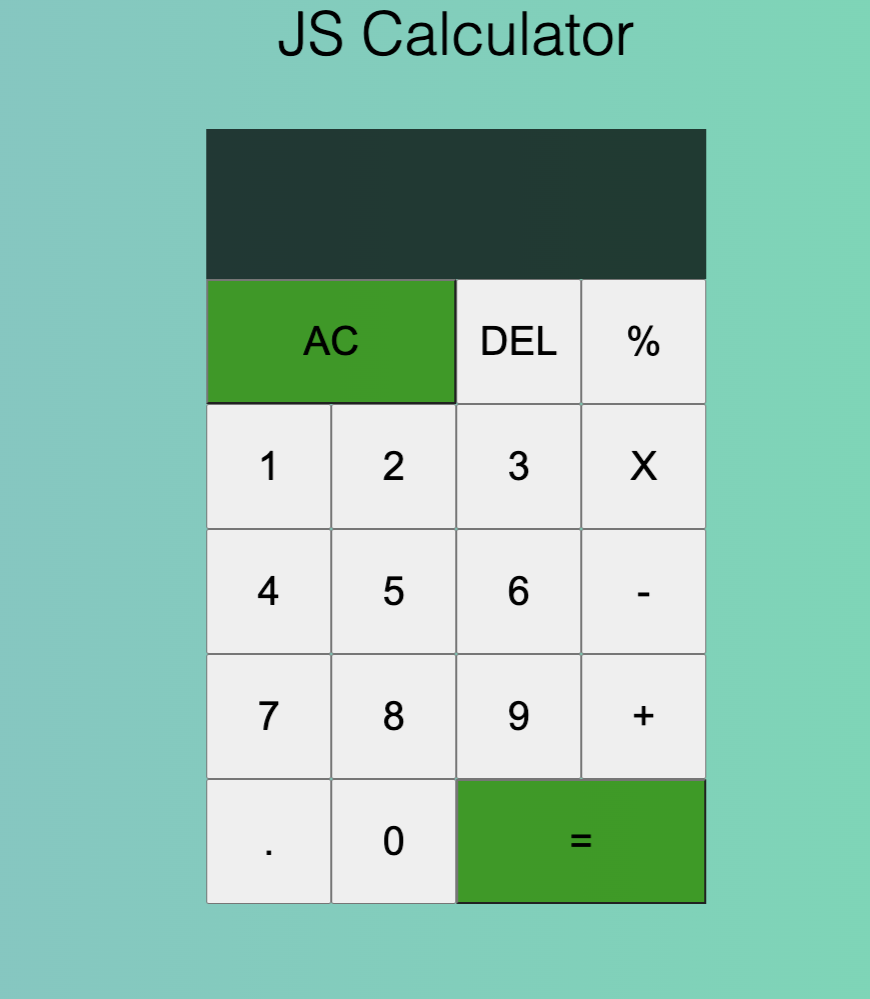
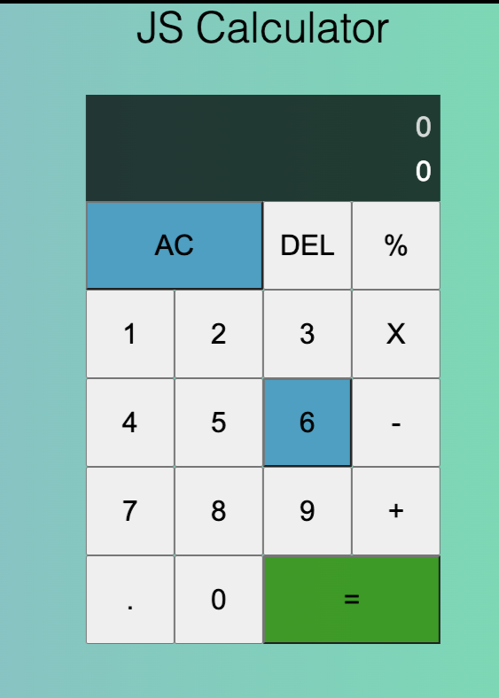
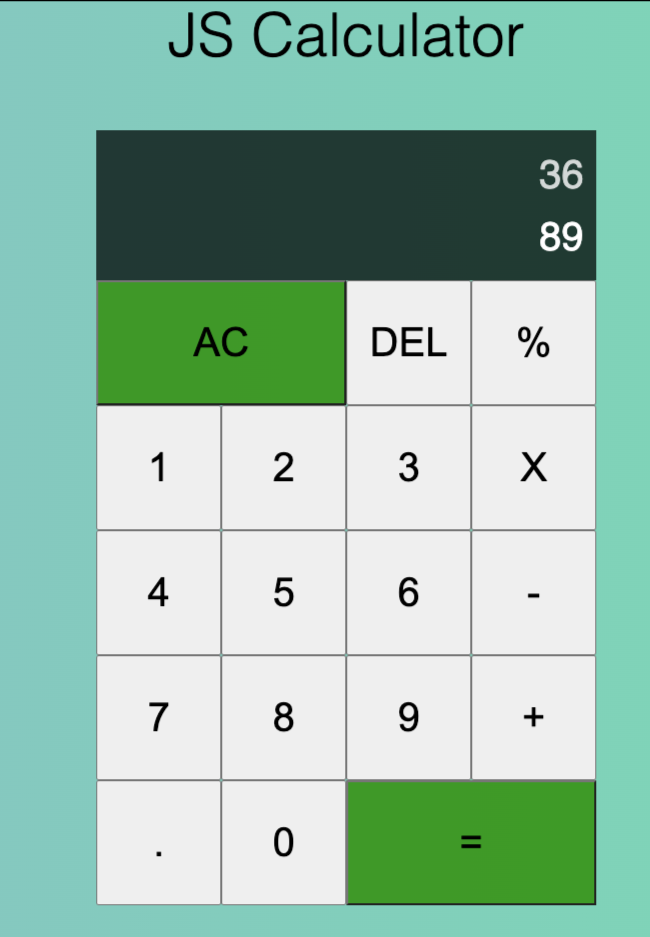
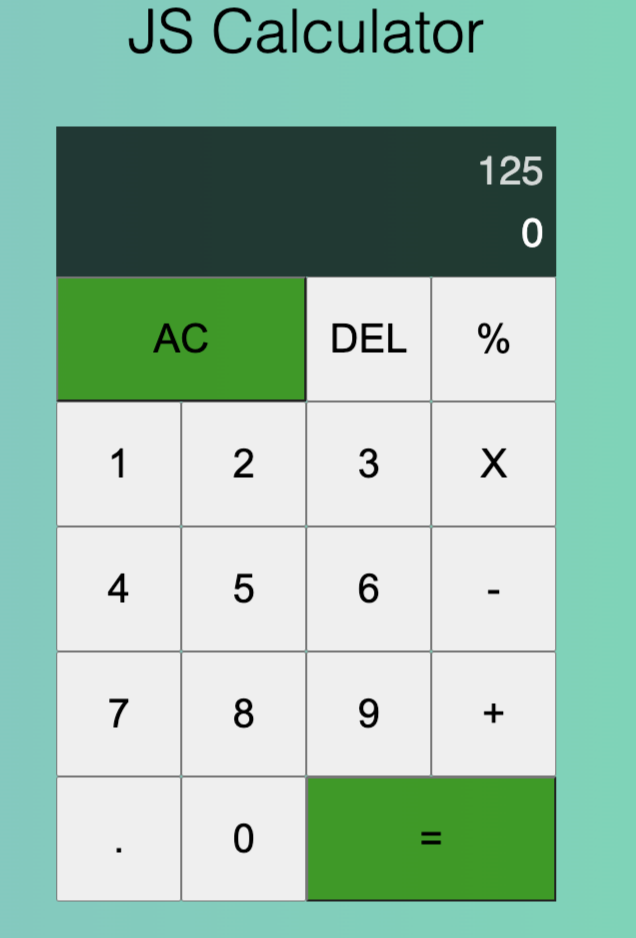

# Calculator

This is an offscript follow along of the Javascript tutorial - ["How to build a calculator using Javascript"](https://www.section.io/engineering-education/building-a-calculator-a-javascript-project-for-beginners/) with the intent to explore ES6 syntax and css grid layouts.

## Table of contents

- [Overview](#overview)
  - [Design Goals](#design-goals)
  - [Screenshot](#screenshot)
  - [Links](#links)
  - [Built with](#built-with)
  - [Authors](#authors)

## Overview

### Design Goals

Users should be able to:

- Perform basic arithmetic with two numbers: add, multiply, divide, and subtract
- Erase the screen
- See the previous result
- Backtrack any errors using the delete key

### Screenshot

### Links

- Live Site URL @ZhouSusan: [Live Link](https://ZhouSusan.github.io/Calculator)
- Live Site URL @ProwlingLynx: [Live Link](https://prowlinglynx.github.io/Calculator)

### Built with
- HTML
- CSS Grid
- Javascript

### Authors

Susan Zhou:
- Github - [Susan Zhou](https://github.com/ZhouSusan)
- Linkedin - [Susan Zhou](https://www.linkedin.com/in/susanzhou-tech/)

Javier Tamez:
- Github - [Javier Tamez @ProwlingLynx](https://github.com/ProwlingLynx)
- Linkedin - [Javier Tamez](https://www.linkedin.com/in/javier-tamez/)